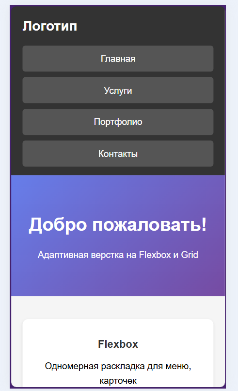
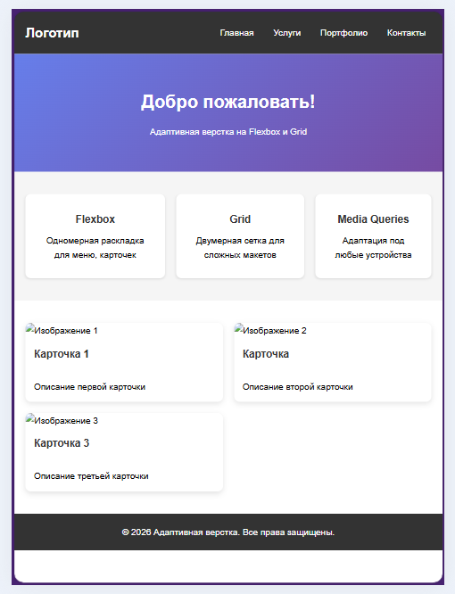

# Лабораторная работа №9. Адаптивная верстка: Медиа-запросы

## Цель:

Изучить принципы адаптивной верстки и медиа-запросов. В конце 
создать адаптивную страницу портфолио, которая корректно отображается на всех 
устройствах.

## Адаптивная верстка 

**Адаптивная верстка** — это подход к созданию веб-страниц, при котором дизайн 
и контент автоматически подстраиваются под размер экрана устройства (компьютер, 
планшет, смартфон).

## Медиа-запрос

В данной лабораторной работе были изучены медиа-запросы.

**Медиа-запросы** (Media Queries) — это техника CSS, которая позволяет применять 
разные стили в зависимости от характеристик устройства (ширина экрана, ориентация, 
разрешение).

**Синтаксис медиа-запросов**
```html
@media (условие) {
    /* стили для этого условия */
}
```

**Пример**
```html
@media (max-width: 768px){
    .container {
        flex-direction: column;
    }
}
```

### В данной работе были применены полученные знания:
**Пример на Phone SE**

**Пример на Ipad Mini**


### Результат

В ходе лабораторной работы были изучены и успешно применены принципы адаптивной верстки с использованием медиа-запросов. Страница корректно отображается на устройствах с разным размером экрана: от смартфонов до планшетов и компьютеров.